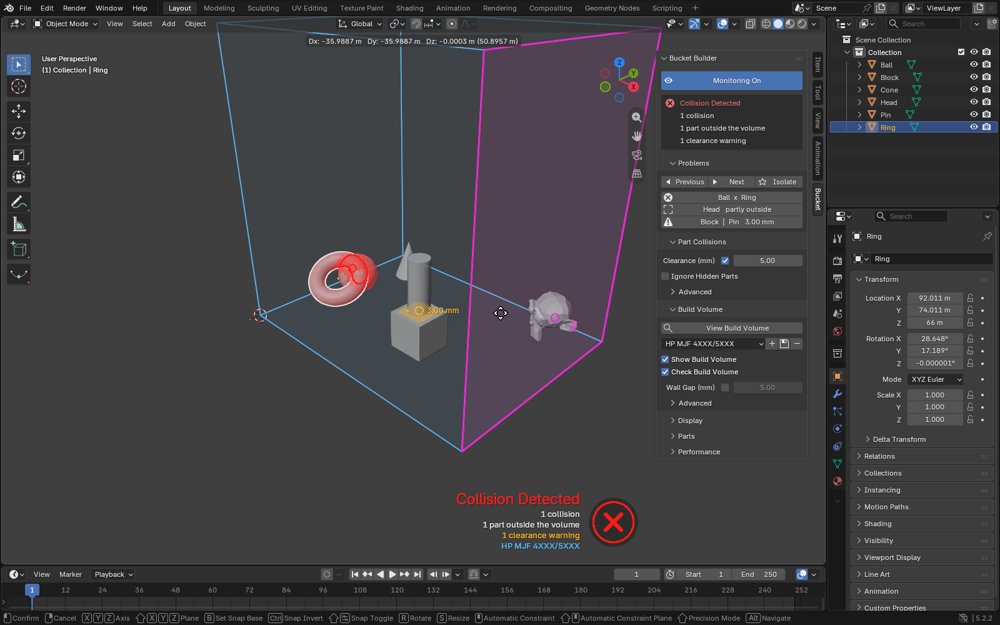
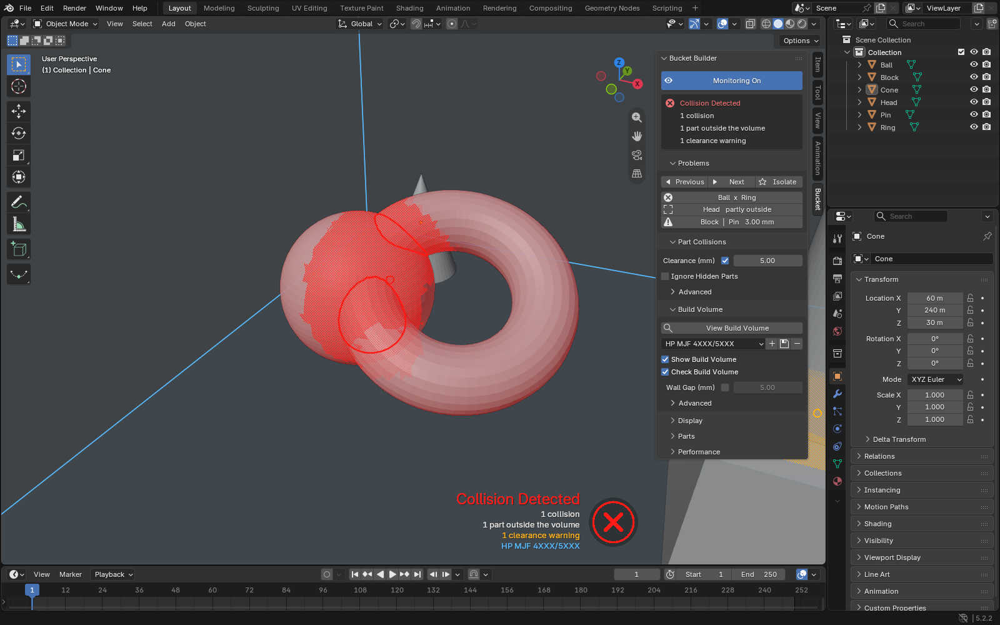
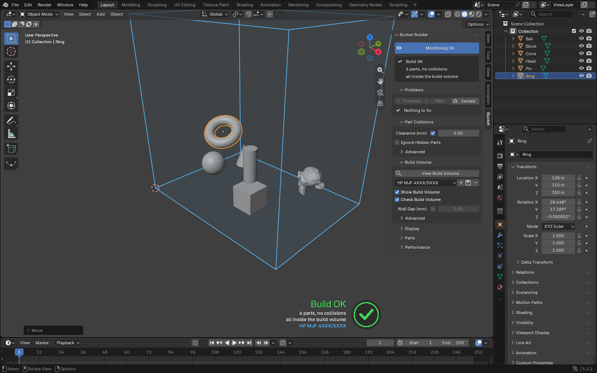
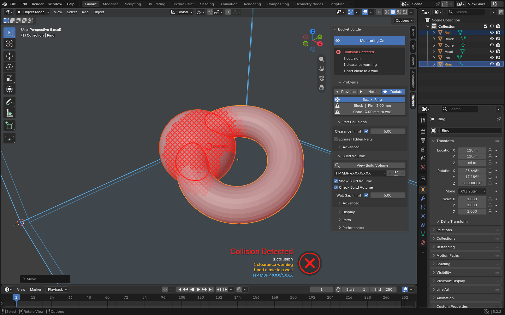
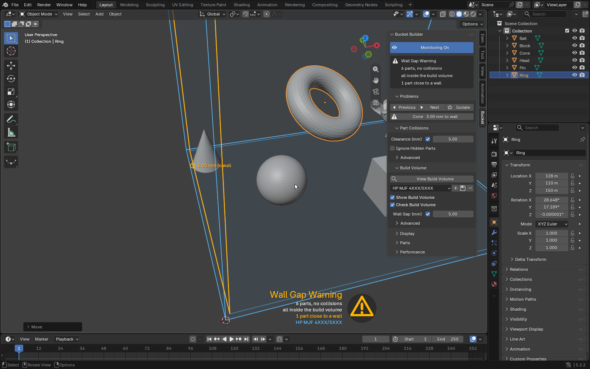
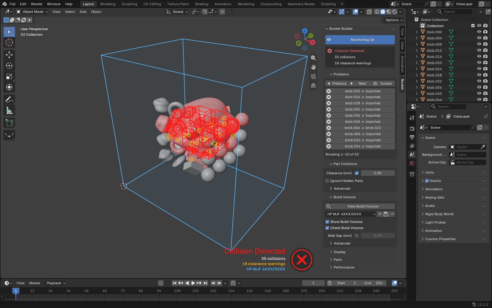
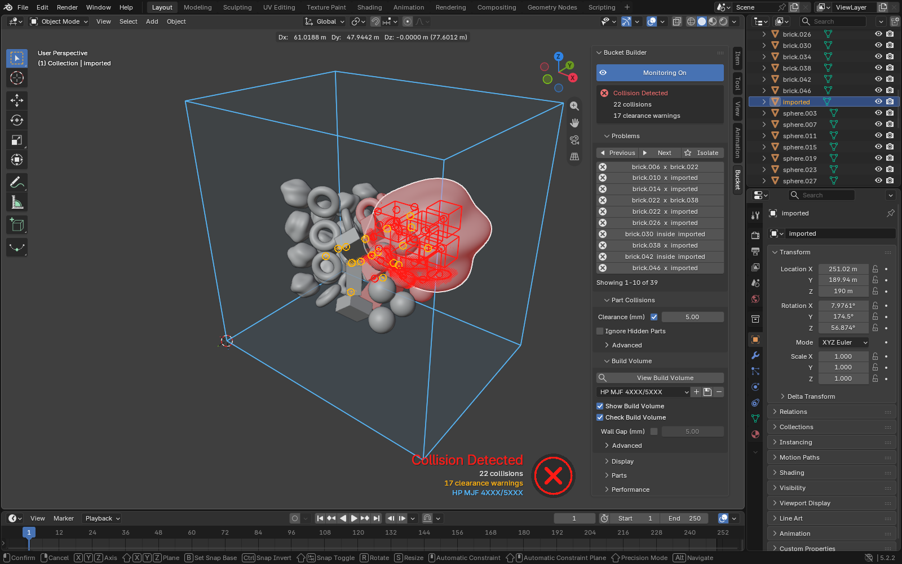

# Blender Bucket Builder

**Bucket Builder** is a Blender add-on for preparing 3D-print builds, aimed at
dense HP Multi Jet Fusion (MJF) builds.

Its first tool is a live build check. Turn monitoring on once, then move,
rotate and scale parts as usual. While you drag, the viewport shows:

* where parts **collide** (red cross-hatching and the exact intersection curve),
* where parts are closer than your **minimum clearance** (amber hatching and the
  measured gap),
* what reaches **outside the printer's build volume** (magenta hatching on just
  the geometry that is out, and the wall it goes through in magenta),
* which parts are at fault: every colliding part is **shaded red**,
* optionally, parts that sit too close to the **side walls** of the volume,
* the verdict in the corner of the viewport: a large **green tick** when there
  are no collisions and every part is inside the volume, an amber triangle for
  warnings, a red cross for what has to be fixed.

Every problem is listed; one click frames it, and **Isolate** shows its parts
on their own. Nothing in the scene is modified; everything is drawn on top of
it.

| | |
| --- | --- |
|  |  |
|  |  |

A large part imported into the middle of a full build, and being dragged out
of it (50 parts; the new one lands on 33 of them):

| | |
| --- | --- |
|  |  |

Screenshots are from the automated window tests (`tests/blender_gui_test.py`,
`tests/blender_gui_stress.py`), with test shapes sized in millimetres inside a
380 x 284 x 380 mm volume.

The user guide is in [bucket_builder/README.md](bucket_builder/README.md).

## Status

Version 1.1.0. Declared for Blender 4.2 and newer. Its tests run on
**Blender 5.2.2** (Linux, software OpenGL), where:

* the geometry engine agrees with brute-force references on random and
  hand-picked cases, and with Blender's own `BVHTree.overlap` on which
  triangles intersect,
* 175 end-to-end checks pass inside Blender (live updates on move / rotate /
  scale, moving a selection, mesh edits, modifiers, linked duplicates, hidden
  parts, the build volume and which of its walls are exceeded, printer
  profiles and a library made by version 1.0, units, the wording of the
  verdict, undo, save and reload; and for large parts: worker threads, the
  memory limit, the warnings about unchecked geometry),
* every panel and menu is drawn against a stand-in for Blender's layout that
  rejects what a real one would,
* the overlay is rendered off-screen and its colours sampled where the walls
  and the badge are,
* in an interactive Blender window on a virtual display (`tests/gui_on_xvfb.sh`)
  a part dragged with simulated mouse input updates the overlay on every step
  of the drag; the badge is found in the corner the sidebar leaves free;
  problems are isolated one after the other with Blender's real local view;
  and undo, redo and delete, triggered with simulated key presses, leave
  Blender standing (`tests/blender_gui_undo.py`, see below),
* version 1.1.0 installed over a 1.0.1 that is in use, in the same session,
  keeps the settings and the user's printers and carries on
  (`tests/blender_upgrade_test.py`).

The owner runs it on Blender 5.2.0 on Windows with an NVIDIA GPU (OpenGL).
Version 1.0.0 crashed Blender there: the add-on's timer read the dependency
graph in the moment between an operator freeing objects and Blender
rebuilding the graph. Since 1.0.1 the graph is brought up to date before the
timer reads it; the crash is reproduced by the tests without that line.
Version 1.1.0 is the interface as he asked for it after his first trial.

Not yet tried: Blender 4.2 - 5.1, macOS, the Vulkan and Metal backends.

### Large builds

Measured on a 2-core virtual machine without a GPU, where one worker thread
does the sorting (there is one per processor core less one, up to four).

| Build | Taking it in | Longest freeze | Drag, per step | Rotate, per step | Memory |
| --- | --- | --- | --- | --- | --- |
| 30 M triangles, 20 parts of 1.5 M (in Blender) | first results after 4 s, all checked after 15 s | 43 ms | 5 ms (32 at worst) | 8 ms (16 at worst) | 2.2 GB |
| 180 M triangles, 600 copies of 12 meshes, each in its own rotation, memory limited to 2 GB (engine alone) | every collision known after 9 s, all distances after 56 s | 211 ms | 12 ms (48 at worst) | 12 ms (30 at worst) | 2.3 GB |

"Longest freeze" is the longest the main thread was busy in one go, so the
longest Blender would not respond. `tests/blender_bench_large.py` and
`tests/bench_scale.py` produce these figures.

## Install

Download or build `bucket_builder-1.1.0.zip`, then in Blender:
Edit > Preferences > Get Extensions > the arrow in the top right >
*Install from Disk*.

To build the zip from this repository:

    blender --command extension build --source-dir bucket_builder --output-dir dist

## How it works

    scene objects
        -> broad phase: bounding boxes of the parts that changed against all others
        -> narrow phase: both parts' bounding-volume trees, traversed together
        -> exact triangle / triangle intersection and distance
        -> viewport drawing

* **One tree per unique mesh.** Triangles are sorted once into an implicit
  bounding-volume tree. Copies of a part share it. Sorting costs about half a
  microsecond per triangle; for large meshes it is done by worker threads,
  which only ever see NumPy arrays.
* **Moving is free.** A part's tree is stored without its translation; the
  offset between two parts is applied while querying. Dragging a part
  therefore rebuilds nothing.
* **Rotating or scaling borrows.** New boxes for a rotated part cost about
  45 ns per triangle, too much per mouse step for a large mesh. So while it is
  edited the part keeps the boxes it had, and they are moved into the new
  orientation as they are looked at (looser, so queries cost about twice as
  much, but nothing is recomputed). Its triangles are posed from the mesh's
  own vertices with the same expression a fitted tree is made with, so they
  are bit-identical to it. A moment after the edit the boxes are fitted
  again, in pieces of a millisecond or two, and what was worked out with
  borrowed boxes is redone: what is on screen at rest does not depend on how
  the parts got there.
* **Only what changed is recomputed.** Results are kept per pair of
  neighbouring parts; when a part moves, only its own pairs are looked at.
* **No Python loops over triangles.** All pairs that need work are traversed
  together, level by level, in NumPy.
* **A live step has a time budget.** Whether two parts collide is always
  decided exactly. How much more each pair gets (the complete intersection
  curve, the hatched region, the proven clearance distance) follows the
  measured cost: with a few neighbours every pair gets everything; when a part
  lands on dozens of others, most pairs are only *sketched* (one intersecting
  triangle pair proves a collision) and the detail fills in for as many as
  fit. Whatever was left out is completed exactly just after release.
* **Nothing blocks.** Fitted trees are built in slices between redraws, and
  pairs whose trees are ready are solved first, so the results of a new scene
  appear as the work gets done.
* **Memory is bounded.** The fitted trees (55 bytes per triangle and part) are
  a cache with a limit; the least recently used are dropped and built again
  when needed. A part without neighbours never gets one.
* **Colliding parts are shaded from a mesh uploaded once** per unique part and
  redrawn with the object's current matrix, so the cheapest answer (collides
  or not) costs nothing to draw while a part moves.

### Why not `mathutils.bvhtree.BVHTree`

It was the starting point, and it is still used as an independent check in the
tests. Two things rule it out for the live path:

* `BVHTree.overlap()` takes no transform, so both trees must be in world
  space and a moving part's tree has to be rebuilt on every step of a drag.
* It reports overlapping triangles only. There is no tree-to-tree distance
  query, which the clearance check needs.

Measured on the same machine, one step of dragging a part into its neighbour,
collision check only (`tests/blender_bvhtree_compare.py`):

| Triangles (both parts) | BVHTree: rebuild the moving tree + overlap | This add-on |
| ---: | ---: | ---: |
| 6,000 | 1.4 ms | 3.6 ms |
| 24,000 | 5.5 ms | 6.3 ms |
| 98,000 | 26.9 ms | 8.0 ms |
| 327,000 | 44.5 ms | 8.0 ms |

The add-on's figure also covers the complete intersection curve and the
geometry the overlay draws. Both find the same intersecting triangle pairs,
with one exception in the 64 steps of that test: a pair that touches along a
millionth of a millimetre, which one counts and the other does not.

## Tests

The engine needs only NumPy:

    python3 tests/test_tritri.py     # triangle routines against slow references
    python3 tests/test_world.py      # the collision world against brute force (about 3 minutes)
    python3 tests/bench.py --quick   # timings on build-sized scenes (--storm: import into a full build)
    python3 tests/bench_scale.py parts 20 1500000        # 30 M triangles
    python3 tests/bench_scale.py instances 600 300000 12 2   # 180 M, 2 GB limit

With the add-on installed and enabled in Blender:

    blender --background --python tests/blender_test.py             # end to end
    blender --background --python tests/blender_large_test.py       # large parts, memory, warnings
    blender --background --python tests/blender_ui_test.py          # panels, menus, the report
    blender --background --python tests/blender_gpu_test.py -- out  # overlay, off-screen PNGs
    blender --background --python tests/blender_bvhtree_compare.py  # against BVHTree
    blender --background --python tests/blender_bench_large.py -- 20 1500000   # timings, large build
    tests/gui_on_xvfb.sh blender out                                # in a window: drag, badge, isolate
    tests/gui_on_xvfb.sh blender out blender_gui_undo.py            # undo, redo, delete in a window
    tests/gui_on_xvfb.sh blender out blender_gui_stress.py          # a full build under the mouse
    blender --background --python tests/blender_upgrade_test.py -- old.zip new.zip   # in an empty profile

## Layout

    bucket_builder/       the add-on (this folder is what gets zipped)
      core/               NumPy engine, no Blender imports
        tritri.py         exact triangle / triangle intersection and distance
        bvh.py            implicit bounding-volume tree layout, sorting a mesh
        arena.py          growable shared storage
        world.py          objects, cached trees, incremental pair results, scheduling
        narrow.py         batched tree traversal, regions, build-volume test
      monitor.py          mirrors the Blender scene into the engine: handlers, timer, workers
      overlay.py          viewport drawing
      props.py            settings, preferences, printer profiles
      ops.py              operators: navigation, isolating, printer profiles, the report
      ui.py               sidebar panels, entries in Blender's own menus
    tests/
    tools/test-blender/   building Blender from source where it cannot be downloaded
    CLAUDE.md             working notes: state, decisions, what is next

## Licence

GPL-3.0-or-later, see [LICENSE](LICENSE).
